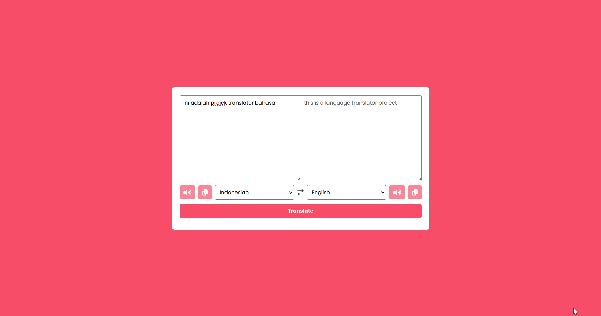

# Translator

A program that functions to translate from one language to another.the translation process uses the API from "https://mymemory.translated.net/doc/spec.php" .

The technologies used to build this project include HTML, CSS, Javascript, SweetAlert2 and Font Awesome 6.

